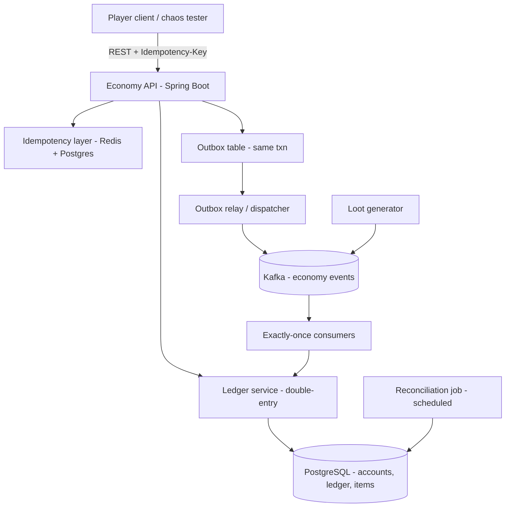

# P1 — LootLedger: a dupe-proof MMO / game-economy engine

> Build first. Largest target cluster, and it reuses your exact stack (Java/Spring/Postgres/Kafka).

## 1. What it is

LootLedger is the backend economy for a fictional online game. Players hold **gold** and **items**, loot drops from monsters, and players trade with each other through an auction house and direct swaps. The whole point of the project is one guarantee:

> **Gold and items can never be duplicated or lost — no matter how clients retry, disconnect, crash, or double-click "trade."**

Item duplication ("duping") is the most infamous class of MMO bug. It's almost always a concurrency or retry bug: a laggy client sends the same "sell" twice, or a server crashes after crediting the buyer but before debiting the seller, and suddenly there are two Legendary Swords where there was one. LootLedger is engineered so that's provably impossible.

There is **no actual game** — you build a headless service plus a load/chaos "player" client. The fun is in the framing and the war stories ("I tried to dupe my own economy 10,000 different ways and failed").

## 2. What you'll demonstrate

Preventing duping is mechanically identical to preventing double-spends of money. This project shows every correctness skill a bank or payments company screens for:

- **Double-entry accounting** — every movement is balanced; value is conserved.
- **Idempotency** — safe retries; the same request applied twice has the effect of once.
- **Exactly-once processing** over an at-least-once message bus.
- **The Saga pattern** — multi-step transactions with compensation.
- **Transactional outbox** — internal state and emitted events never diverge.
- **Reconciliation & auditability** — prove correctness after the fact.
- **Concurrency control** — no lost updates under contention.

It also plugs straight into your resume story: your Amazon work was idempotent, atomic, rollback-safe deletion at scale; your Paytm/MoneyLion work was payments. LootLedger is "the same guarantees, proven from scratch."

## 3. Tech stack (and why)

- **Java 21 + Spring Boot 3** — your primary stack; Spring's `@Transactional`, JPA/Hibernate, and validation are exactly what you used at Amazon/Paytm.
- **PostgreSQL 16** — the source of truth. You need real transactions, unique constraints, and `INSERT ... ON CONFLICT`. Postgres is the reference DB for the idempotency patterns below.
- **Redis 7** — hot-path idempotency cache and distributed locks (fast pre-check before hitting Postgres).
- **Apache Kafka** — the loot/event stream (monster kills, auction sales) that must be consumed exactly-once.
- **Flyway** — versioned DB migrations (shows production discipline).
- **Testcontainers + JUnit 5** — spin real Postgres/Kafka/Redis in tests (no mocks for the parts that matter).
- **Docker Compose** — one command to run the whole thing.
- **Gradle**, **GitHub Actions** for CI.

Optional: **jqwik** for property-based testing, **Debezium** for CDC (stretch).

## 4. Architecture



**Core services:**

- **Economy API** — REST endpoints for balances, transfers, trades, auction bids.
- **Ledger service** — the double-entry engine; the only code allowed to write balances.
- **Idempotency layer** — dedups requests before they hit business logic.
- **Outbox relay** — reads unpublished outbox rows and publishes to Kafka, marking them sent.
- **Loot/event consumers** — apply Kafka events (e.g., "player looted 100 gold") exactly once.
- **Reconciliation job** — periodically proves the conservation invariant and flags drift.

## 5. Data model

Think in terms of **accounts** and **postings** (double-entry). Every currency is a set of accounts; every item type is a set of accounts too (an item balance is just a count that must stay >= 0).

```sql
-- An account holds a balance of one asset (gold, or a specific item type) for one owner.
CREATE TABLE account (
  id           BIGSERIAL PRIMARY KEY,
  owner_id     BIGINT NOT NULL,             -- player id, or a system account
  asset        TEXT   NOT NULL,             -- 'GOLD', 'ITEM:legendary_sword', ...
  kind         TEXT   NOT NULL,             -- 'PLAYER', 'FAUCET' (mint), 'SINK' (burn), 'ESCROW'
  balance      BIGINT NOT NULL DEFAULT 0,   -- derived cache; source of truth is the ledger
  version      BIGINT NOT NULL DEFAULT 0,   -- optimistic lock
  UNIQUE (owner_id, asset)
);

-- A transfer is one logical operation; it has >= 2 balanced postings.
CREATE TABLE transfer (
  id            BIGSERIAL PRIMARY KEY,
  external_id   UUID NOT NULL,              -- from the idempotency key
  type          TEXT NOT NULL,              -- 'TRADE', 'LOOT', 'AUCTION_SETTLE', ...
  created_at    TIMESTAMPTZ NOT NULL DEFAULT now(),
  UNIQUE (external_id)
);

-- Postings: debits and credits. Sum of amounts per transfer per asset MUST be zero.
CREATE TABLE posting (
  id           BIGSERIAL PRIMARY KEY,
  transfer_id  BIGINT NOT NULL REFERENCES transfer(id),
  account_id   BIGINT NOT NULL REFERENCES account(id),
  asset        TEXT   NOT NULL,
  amount       BIGINT NOT NULL              -- negative = debit, positive = credit
);

-- Idempotency records (the load-bearing table).
CREATE TABLE idempotency_key (
  key           TEXT PRIMARY KEY,           -- client-supplied Idempotency-Key
  request_hash  TEXT NOT NULL,              -- hash of the request body
  status        TEXT NOT NULL,              -- 'IN_FLIGHT', 'SUCCEEDED', 'FAILED'
  response_code INT,
  response_body JSONB,
  transfer_id   BIGINT REFERENCES transfer(id),
  created_at    TIMESTAMPTZ NOT NULL DEFAULT now()
);

-- Transactional outbox.
CREATE TABLE outbox (
  id           BIGSERIAL PRIMARY KEY,
  aggregate    TEXT NOT NULL,
  event_type   TEXT NOT NULL,
  payload      JSONB NOT NULL,
  published    BOOLEAN NOT NULL DEFAULT FALSE,
  created_at   TIMESTAMPTZ NOT NULL DEFAULT now()
);
```

**Key invariants** (these are what you test relentlessly):

1. For every `transfer`, `SUM(posting.amount)` per asset = 0 (balanced).
2. `account.balance` = `SUM(posting.amount)` for that account (derived matches cache).
3. No `PLAYER` account balance is ever negative.
4. Total gold across all accounts = total minted by `FAUCET` accounts (conservation).

## 6. Implementation plan (milestones)

Each milestone is independently shippable and demoable.

**M1 — Skeleton + accounts + naive transfer.**
- Spring Boot app, Postgres via Docker Compose, Flyway migrations for the schema above.
- `POST /transfers` that moves gold from A to B by writing a balanced pair of postings in one `@Transactional` method, updating `account.balance`, and rejecting overdrafts.
- `GET /accounts/{owner}/balances`.
- Write the invariant checker as a service method and a test.

**M2 — Idempotency done correctly.**
- Require an `Idempotency-Key` header on all mutating endpoints.
- On request: compute `request_hash`. Try `INSERT INTO idempotency_key (...) VALUES (..., 'IN_FLIGHT')`. 
  - If insert succeeds -> you own this request; run the business logic **in the same transaction** as flipping the key row to `SUCCEEDED` and storing the response.
  - If insert conflicts -> a duplicate. If stored status is `SUCCEEDED`, return the **stored response verbatim**. If `IN_FLIGHT`, return `409 Conflict`/retry-after. If the stored `request_hash` differs -> `422` (key reused with different body).
- Add Redis as a fast pre-check (SET NX with TTL) but **Postgres is the authority** — the unique constraint is what actually prevents the race.

**M3 — Trades as a Saga (two-sided swap).**
- `POST /trades`: player A gives X gold + item, player B gives Y gold + item.
- Steps: (1) escrow both sides into an `ESCROW` account, (2) cross the escrows to the counterparties, (3) mark complete. Each step is idempotent.
- If any step fails or times out, run **compensations** (release escrow back). Persist saga state so a restart resumes correctly.

**M4 — Loot stream + exactly-once consumers.**
- A `loot-generator` publishes "player P looted N gold / item I" to Kafka.
- Consumer applies each event as a `LOOT` transfer from a `FAUCET` account to the player.
- Exactly-once: consumer uses the Kafka event key as the idempotency key; applying the same event twice is a no-op. Commit Kafka offsets only after the DB transaction commits (or use the idempotency table to dedup regardless of offset replays).

**M5 — Transactional outbox.**
- When a trade/loot commits, write an `outbox` row in the **same transaction**.
- A relay polls unpublished rows, publishes to Kafka, marks them published. This guarantees "if the state changed, the event will eventually be emitted, exactly once downstream (with idempotent consumers)."

**M6 — Reconciliation + audit + chaos.**
- Scheduled job recomputes balances from postings and asserts all four invariants; emits a metric and alerts on drift.
- Audit log: every transfer records who/what/when/why (reuse your GDPR audit-trail experience).
- Chaos: see testing section.

## 7. The hard parts, explained

**Why store the idempotency key in the same transaction as the mutation?** If you check Redis, then write Postgres in a separate step, two concurrent replays can both pass the Redis check before either writes. The key row and the business rows must **commit together or not at all**. The `UNIQUE(key)` constraint is the actual serialization point.

**Why return the original response on a duplicate?** A retried request must get the same outcome it would have gotten the first time — including the same error. Returning a bare `200 OK` with no body breaks clients that expected the original payload (this is how Stripe behaves).

**The `IN_FLIGHT` state** prevents two concurrent first-time requests (same key) from both executing side effects: the second sees `IN_FLIGHT` and waits/retries rather than running.

**Concurrency on balances** — two trades touching the same account can race. Use optimistic locking (`version` column, retry on conflict) or `SELECT ... FOR UPDATE` on the account rows in a deterministic order (always lock lower account id first) to avoid deadlocks.

**Exactly-once is really "effectively-once"** — Kafka gives at-least-once delivery; you make consumers idempotent so redelivery is harmless. Say it precisely in interviews.

## 8. Testing & correctness

This is where the project earns its keep — over-invest here.

- **Unit tests** for the ledger invariants (balanced postings, no negative balances).
- **Testcontainers integration tests** against real Postgres/Kafka/Redis.
- **The dupe chaos test** (the headline): fire the same trade with the same `Idempotency-Key` from, say, 200 threads simultaneously; assert exactly one transfer was created and totals are unchanged.
- **Crash-injection test**: kill the process (or throw) between escrow and cross-over in a trade; on restart, assert the saga either completes or fully compensates — never leaves value stranded or duplicated.
- **Property-based test (jqwik)**: generate random sequences of loots and trades among N players; after replay, assert conservation of gold and no negative balances hold for *every* generated sequence.
- **Reconciliation test**: intentionally corrupt a balance cache, run reconciliation, assert it detects the drift.

## 9. Benchmarking & metrics (put your real numbers on the resume)

- Throughput: transfers/sec and trades/sec (use a load client; e.g., target 2,000+ transfers/sec locally).
- Latency: p50/p95/p99 for `POST /transfers`.
- **Zero double-spends across N concurrent duplicate storms** (report N).
- Reconciliation: invariant holds across a fault-injection run of M crashes.
- Consumer: events applied exactly once across a forced offset replay.

## 10. How to run

```bash
docker compose up -d        # postgres, kafka, redis
./gradlew flywayMigrate
./gradlew bootRun           # the economy API + relay + consumers
./gradlew test              # includes the chaos + property tests
python load/players.py      # the chaos/load client (or a Gatling/k6 script)
```

## 11. Suggested repo structure

```
lootledger/
  build.gradle
  docker-compose.yml
  db/migrations/                 # Flyway V1__schema.sql, ...
  src/main/java/.../
    api/                         # controllers, DTOs, Idempotency-Key filter
    ledger/                      # LedgerService, invariant checks
    idempotency/                 # IdempotencyService (Redis + Postgres)
    trade/                       # Saga orchestrator + compensations
    loot/                        # Kafka consumers
    outbox/                      # relay
    recon/                       # scheduled reconciliation
  src/test/java/.../             # unit + Testcontainers + chaos + property tests
  load/players.py                # chaos/load generator
  README.md                      # architecture + how you proved no dupes
```

## 12. Stretch goals

- **Auction house** with bid escrow and second-price settlement (reuses the same primitives).
- **CDC via Debezium** streaming ledger changes to a read model.
- A tiny **React inventory + trade-history UI**.
- **Multi-currency** with FX between gold and a premium currency (adds cross-asset transfers).

## Resume bullets (tune with your real numbers)

- Built **LootLedger**, a **double-entry game-economy engine** (**Java**, **Spring Boot**, **PostgreSQL**, **Kafka**, **Redis**) with **idempotency keys** committed atomically with each trade, proving **zero item/gold duplication** across concurrent chaos tests — the same exactly-once guarantee payment systems require.
- Guaranteed consistency for player-to-player swaps via a **Saga** with compensations and **exactly-once** Kafka consumers, sustaining **2K+ trades/sec**, with an automated reconciliation job verifying conservation-of-value after fault injection.
