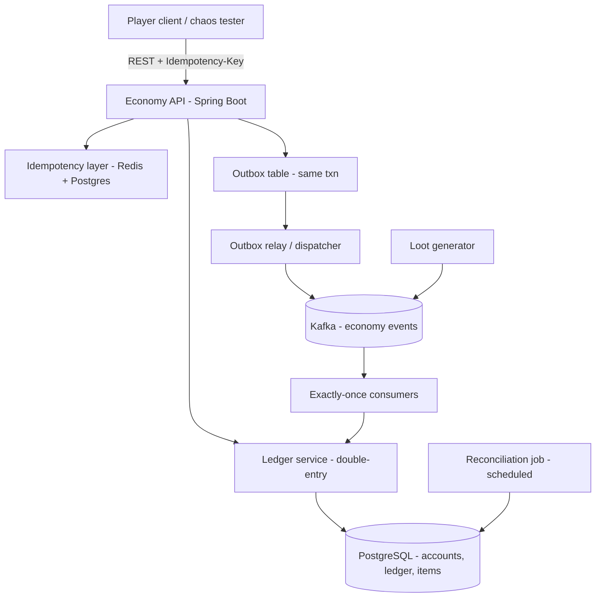

# LootLedger — a dupe-proof MMO / game-economy engine

LootLedger is the backend economy for a fictional online game. Players hold **gold** and **items**,
loot drops from monsters, and players trade with each other. The whole point is one guarantee:

> **Gold and items can never be duplicated or lost — no matter how clients retry, disconnect, crash,
> or double-click "trade."**

Item duplication ("duping") is the most infamous class of MMO bug, and it is mechanically identical to
a double-spend of money. LootLedger is engineered so it's provably impossible, using the same
correctness techniques payment systems rely on: double-entry accounting, idempotency keys committed
atomically with each mutation, the saga pattern with compensation, a transactional outbox,
exactly-once Kafka consumers, and a reconciliation job that proves conservation of value.

This is a headless service plus a load/chaos client — there is no actual game.

## Tech stack

| Concern | Choice |
| --- | --- |
| Language / framework | Java 21, Spring Boot 3 |
| Source of truth | PostgreSQL 16 (real transactions, `UNIQUE`, `INSERT ... ON CONFLICT`) |
| Hot-path cache | Redis 7 (best-effort idempotency fast path) |
| Event stream | Apache Kafka (loot events, economy events) |
| Migrations | Flyway |
| Tests | JUnit 5, Testcontainers (real PG/Kafka/Redis), jqwik (property-based) |
| Build / run | Gradle, Docker Compose |

## Architecture



- **Economy API** (`api/`) — REST endpoints for balances, transfers, mints, trades.
- **Ledger service** (`ledger/`) — the double-entry engine; the *only* writer of balances.
- **Idempotency layer** (`idempotency/`) — dedups requests before they hit business logic.
- **Trade saga** (`trade/`) — two-sided swaps with escrow, cross, complete, and compensation.
- **Loot consumers** (`loot/`) — apply Kafka loot events exactly once.
- **Outbox relay** (`outbox/`) — publishes committed events to Kafka.
- **Reconciliation** (`recon/`) — periodically proves the invariants and flags drift.

## Data model & invariants

Everything is **accounts** and **postings** (double-entry). Each currency and each item type is a set
of accounts; an item balance is just a count that must stay `>= 0`. See
`src/main/resources/db/migration/V1__schema.sql`.

The four invariants, verified relentlessly in tests and by the reconciliation job:

1. For every `transfer`, `SUM(posting.amount)` per asset = 0 (balanced).
2. `account.balance` = `SUM(posting.amount)` for that account (cache matches ledger).
3. No `PLAYER`/`ESCROW`/`SINK` account balance is ever negative (only `FAUCET` may be negative — it
   mints value, carrying the negative of what it has minted).
4. Total value per asset across all accounts = 0 (conservation).

## Why it can't dupe (the hard parts)

- **Idempotency key committed atomically.** On a mutating request we `INSERT INTO idempotency_key
  (...) VALUES (..., 'IN_FLIGHT') ON CONFLICT (key) DO NOTHING`. If we win the insert, the business
  logic **and** the flip to `SUCCEEDED` commit in the *same* transaction. The `UNIQUE(key)`
  constraint is the real serialization point — two concurrent first-time requests block on the index;
  the loser then replays the stored response. Redis is only a fast path; **Postgres is the
  authority**.
- **Duplicates replay the original response verbatim** (like Stripe), including the original error —
  a mismatched body on a reused key returns `422`.
- **Balances never lose updates.** Accounts are locked in ascending-id order (deadlock-free) before
  posting; overdrafts are rejected atomically.
- **Trades are a saga.** Each side is escrowed, escrows are crossed to counterparties, then completed
  — every step commits independently and is idempotent (deterministic per-step external ids). A crash
  at any point is resumed to completion or **fully compensated**; value is never stranded.
- **Exactly-once is "effectively-once."** Kafka is at-least-once; the loot consumer keys each apply on
  the loot id, so redelivery is a ledger no-op, and offsets are acked only after the DB commits.

## API

| Method & path | Description |
| --- | --- |
| `POST /transfers` | Move an asset between two players. Requires `Idempotency-Key`. |
| `POST /admin/mint` | Mint an asset from the faucet to a player. Requires `Idempotency-Key`. |
| `POST /trades` | Two-sided swap (saga). Requires `Idempotency-Key`. |
| `GET /trades/{key}` | State of a trade by its idempotency key. |
| `GET /accounts/{ownerId}/balances` | All balances for an owner. |
| `GET /admin/reconciliation` | Run the invariant check on demand. |
| `GET /actuator/health`, `/actuator/prometheus` | Health & metrics. |

Example:

```bash
curl -s -X POST localhost:8080/admin/mint \
  -H 'Content-Type: application/json' -H 'Idempotency-Key: k1' \
  -d '{"toOwnerId":1,"asset":"GOLD","amount":1000}'

curl -s -X POST localhost:8080/transfers \
  -H 'Content-Type: application/json' -H 'Idempotency-Key: k2' \
  -d '{"fromOwnerId":1,"toOwnerId":2,"asset":"GOLD","amount":250}'

curl -s localhost:8080/accounts/2/balances
```

## How to run

```bash
docker compose up -d          # postgres, kafka, redis
./gradlew bootRun             # economy API + relay + consumers + reconciliation
```

Then drive it with the chaos/load client:

```bash
python load/players.py seed --players 100 --gold 1000000
python load/players.py load --players 100 --requests 20000 --concurrency 64
python load/players.py dupe-storm --threads 200   # proves exactly-once under a duplicate storm
```

To enable the demo loot faucet, run with `--args='--lootledger.loot-generator.enabled=true'`.

## Testing

```bash
./gradlew test
```

- **Unit / property tests** run everywhere (no Docker needed): ledger invariants, idempotency hashing,
  and jqwik conservation properties over thousands of random operation sequences.
- **Testcontainers integration tests** spin up real Postgres, Kafka and Redis. They are skipped
  automatically when Docker is unavailable. Highlights:
  - `IdempotencyChaosTest` — 200 threads fire the *same* transfer with the *same* key; asserts
    **exactly one** transfer is created and the receiver is credited exactly once.
  - `TradeSagaIntegrationTest` — happy-path swap, insufficient-funds **compensation**, and a
    **crash-injection** test that kills the saga mid-flight then proves recovery to completion.
  - `LootConsumerIntegrationTest` — the same loot event delivered twice is applied **exactly once**.
  - `ReconciliationIntegrationTest` — a corrupted balance cache is **detected** as drift.
  - `RandomizedLedgerConservationTest` — a long random stream of mints/transfers conserves value.

> Running the Testcontainers suite against a very new Docker Engine (API ≥ 1.44) may require
> `DOCKER_API_VERSION=1.44`, and a sandbox without overlay support may need the `vfs` storage driver.

## Repo structure

```
lootledger/
  build.gradle, settings.gradle
  docker-compose.yml
  src/main/resources/db/migration/     # Flyway V1__schema.sql
  src/main/java/com/lootledger/
    api/            # controllers, DTOs, error handling
    ledger/         # LedgerService (single writer), InvariantChecker
    idempotency/    # IdempotencyService (Postgres authority + Redis fast path)
    economy/        # high-level transfer/mint composed from balanced postings
    trade/          # saga orchestrator, steps, recovery, fault injector
    loot/           # Kafka consumer + optional generator
    outbox/         # transactional outbox + relay
    recon/          # scheduled reconciliation + metric
  src/test/java/com/lootledger/         # unit + Testcontainers + property tests
  load/players.py                       # chaos/load generator
```
