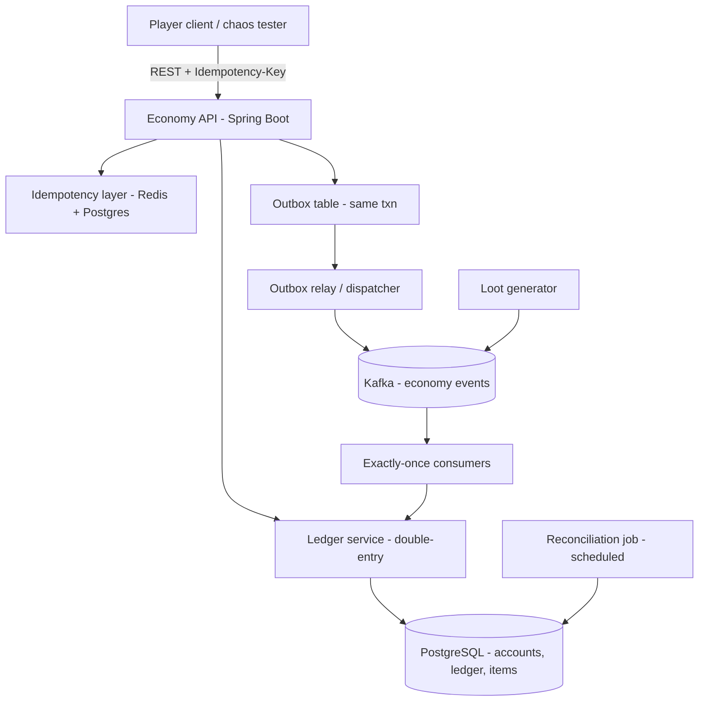

# LootLedger — a dupe-proof MMO / game-economy engine

[](https://github.com/RakMan09/lootledger/actions/workflows/ci.yml)

LootLedger is the backend economy for a fictional online game. Players hold **gold** and **items**,
loot drops from monsters, and players trade with each other. The whole point is one guarantee:

> **Gold and items can never be duplicated or lost — no matter how clients retry, disconnect, crash,
> or double-click "trade."**

Item duplication ("duping") is the most infamous class of MMO bug, and it is mechanically identical to
a double-spend of money. LootLedger is engineered so it's provably impossible, using the same
correctness techniques payment systems rely on: double-entry accounting, idempotency keys committed
atomically with each mutation, the saga pattern with compensation, a transactional outbox,
exactly-once Kafka consumers, and a reconciliation job that proves conservation of value.

This is a headless service plus a load/chaos client — there is no actual game. In banking terms it's
a tiny, correct-by-construction bank: players are account holders, gold and items are balances, and
loot/trades are transactions that must always balance.

**Live demo:** https://rakman09.github.io/lootledger/

## Contents

- [The live demo site](#the-live-demo-site)
- [See it work / prove it](#see-it-work--prove-it)
- [Tech stack](#tech-stack)
- [Architecture](#architecture)
- [Data model & invariants](#data-model--invariants)
- [Why it can't dupe (the hard parts)](#why-it-cant-dupe-the-hard-parts)
- [API](#api)
- [How to run](#how-to-run)
- [Testing](#testing)
- [Metrics & benchmarking](#metrics--benchmarking)
- [Repo structure](#repo-structure)

## The live demo site

There is a live, zero-install page anyone can open in a browser:

### https://rakman09.github.io/lootledger/

It lets you *play with the economy and try to break it* right from the page — nothing to download.

**What it is (and an honest note).** GitHub Pages can only serve static files, so it can't run the real
Java/PostgreSQL service. The site therefore runs a **faithful client-side simulation** of LootLedger's
actual ledger + idempotency logic in JavaScript — same rules, same outcomes — purely so it's instantly
approachable. The *real* system is the Spring Boot backend in this repo, and its correctness is proven
by an automated attack suite that runs on real Postgres/Kafka/Redis in CI (the badge at the top links
to the live logs). The page says this clearly and links back to the real proof.

**What you can do on the site:**

- **Try to dupe the economy** — the headline. Pick a number of *identical* requests (say 200) that
  all share one Idempotency-Key — exactly what a laggy client or a double-click does — and fire them.
  You'll see them collapse to **exactly one** executed transfer, the receiver credited once, and the
  rest deduplicated. This is the whole promise, made tangible.
- **Playground** — mint gold from the faucet, transfer gold between players, and inspect balances.
- **The auditor** — recompute every balance from the immutable posting log and check the four
  invariants (balanced, cache matches ledger, no illegal negatives, conservation of value).
- **Live metrics** — running counters for your session (transfers, duplicates prevented, mints,
  overdrafts rejected).
- **Architecture diagram** plus links to the source, CI, and deployment guide.

**The same thing, for real.** Every panel above also exists on the *real* dashboard served by the
backend at [`http://localhost:8080`](http://localhost:8080) when you run it — there the buttons hit the
actual Java/Postgres API. You also get interactive API docs at `/swagger-ui.html`, a live invariant
check at `/admin/reconciliation`, and JSON metrics at `/admin/metrics`. To publish your own public URL
for the real backend, see [`DEPLOY.md`](DEPLOY.md).

> Enabling the site (repo owner, one-time): **Settings → Pages → Deploy from a branch → `main` / `docs`**.

## See it work / prove it

Correctness here isn't a claim — it's **self-checking and reproducible**. Three ways to verify:

1. **Automated proof (CI).** Every push runs the anti-dupe attack suite against real Postgres, Kafka
   and Redis on GitHub's runners. The badge above links to public, clickable logs — look for
   `concurrentDuplicateStormCreatesExactlyOneTransfer`, `crashBetweenEscrowStepsIsRecoveredToCompletion`,
   and `redeliveredLootIsAppliedExactlyOnce`.
2. **Interactive demo.** Play with it yourself — either the zero-install
   [live site](#the-live-demo-site) (browser simulation) or the **real backend** dashboard at
   [`http://localhost:8080`](http://localhost:8080) when you run it locally (same UI, hitting the actual
   Java/Postgres API, with Swagger at `/swagger-ui.html` and a live invariant check at
   `/admin/reconciliation`).
3. **One-command live proof.** With an instance running, `./demo.sh` seeds players, benchmarks
   throughput/latency, fires a 200-request duplicate storm, and reconciles — printing PASS/FAIL.

```bash
docker compose -f docker-compose.demo.yml up --build   # app + Postgres only, http://localhost:8080
```

<details>
<summary>Sample <code>./demo.sh</code> run (real output)</summary>

```text
== LootLedger live proof ==
API: http://localhost:8080

1) Seeding players with gold
Seeded 20/20 players.

2) Benchmarking transfers (throughput + latency)
Completed 3000 requests in 3.87s
Throughput: 774 req/s
Latency ms  p50=26.5  p95=53.2  p99=1093.2  max=1229.1
Status codes: {201: 3000}

3) Duplicate storm — firing 200 identical requests with ONE Idempotency-Key
Responses: 200  2xx=200  fresh(non-replayed)=1
Receiver balance delta: 100 (expected exactly 100)
PASS: exactly one transfer applied. No dupes.

4) Reconciliation — proving conservation of value
{"ok":true,"violations":[]}
PASS: all invariants hold — value is conserved, nothing duped.

== Demo complete: the economy survived every attack. ==
```

200 identical requests, one shared Idempotency-Key → **exactly one** executed (`fresh=1`), the
receiver gained exactly 100 gold, and reconciliation confirms nothing leaked.
</details>

## Tech stack

| Concern | Choice |
| --- | --- |
| Language / framework | Java 21, Spring Boot 3 |
| Source of truth | PostgreSQL 16 (real transactions, `UNIQUE`, `INSERT ... ON CONFLICT`) |
| Hot-path cache | Redis 7 (best-effort idempotency fast path) |
| Event stream | Apache Kafka (loot events, economy events) |
| Migrations | Flyway |
| Tests | JUnit 5, Testcontainers (real PG/Kafka/Redis), jqwik (property-based) |
| Build / run | Gradle, Docker Compose |

## Architecture



- **Economy API** (`api/`) — REST endpoints for balances, transfers, mints, trades.
- **Ledger service** (`ledger/`) — the double-entry engine; the *only* writer of balances.
- **Idempotency layer** (`idempotency/`) — dedups requests before they hit business logic.
- **Trade saga** (`trade/`) — two-sided swaps with escrow, cross, complete, and compensation.
- **Loot consumers** (`loot/`) — apply Kafka loot events exactly once.
- **Outbox relay** (`outbox/`) — publishes committed events to Kafka.
- **Reconciliation** (`recon/`) — periodically proves the invariants and flags drift.

## Data model & invariants

Everything is **accounts** and **postings** (double-entry). Each currency and each item type is a set
of accounts; an item balance is just a count that must stay `>= 0`. See
`src/main/resources/db/migration/V1__schema.sql`.

The four invariants, verified relentlessly in tests and by the reconciliation job:

1. For every `transfer`, `SUM(posting.amount)` per asset = 0 (balanced).
2. `account.balance` = `SUM(posting.amount)` for that account (cache matches ledger).
3. No `PLAYER`/`ESCROW`/`SINK` account balance is ever negative (only `FAUCET` may be negative — it
   mints value, carrying the negative of what it has minted).
4. Total value per asset across all accounts = 0 (conservation).

## Why it can't dupe (the hard parts)

- **Idempotency key committed atomically.** On a mutating request we `INSERT INTO idempotency_key
  (...) VALUES (..., 'IN_FLIGHT') ON CONFLICT (key) DO NOTHING`. If we win the insert, the business
  logic **and** the flip to `SUCCEEDED` commit in the *same* transaction. The `UNIQUE(key)`
  constraint is the real serialization point — two concurrent first-time requests block on the index;
  the loser then replays the stored response. Redis is only a fast path; **Postgres is the
  authority**.
- **Duplicates replay the original response verbatim** (like Stripe), including the original error —
  a mismatched body on a reused key returns `422`.
- **Balances never lose updates.** Accounts are locked in ascending-id order (deadlock-free) before
  posting; overdrafts are rejected atomically.
- **Trades are a saga.** Each side is escrowed, escrows are crossed to counterparties, then completed
  — every step commits independently and is idempotent (deterministic per-step external ids). A crash
  at any point is resumed to completion or **fully compensated**; value is never stranded.
- **Exactly-once is "effectively-once."** Kafka is at-least-once; the loot consumer keys each apply on
  the loot id, so redelivery is a ledger no-op, and offsets are acked only after the DB commits.

## API

| Method & path | Description |
| --- | --- |
| `POST /transfers` | Move an asset between two players. Requires `Idempotency-Key`. |
| `POST /admin/mint` | Mint an asset from the faucet to a player. Requires `Idempotency-Key`. |
| `POST /trades` | Two-sided swap (saga). Requires `Idempotency-Key`. |
| `GET /trades/{key}` | State of a trade by its idempotency key. |
| `GET /accounts/{ownerId}/balances` | All balances for an owner. |
| `GET /admin/reconciliation` | Run the invariant check on demand. |
| `GET /actuator/health`, `/actuator/prometheus` | Health & metrics. |

Example:

```bash
curl -s -X POST localhost:8080/admin/mint \
  -H 'Content-Type: application/json' -H 'Idempotency-Key: k1' \
  -d '{"toOwnerId":1,"asset":"GOLD","amount":1000}'

curl -s -X POST localhost:8080/transfers \
  -H 'Content-Type: application/json' -H 'Idempotency-Key: k2' \
  -d '{"fromOwnerId":1,"toOwnerId":2,"asset":"GOLD","amount":250}'

curl -s localhost:8080/accounts/2/balances
```

## How to run

```bash
docker compose up -d          # postgres, kafka, redis
./gradlew bootRun             # economy API + relay + consumers + reconciliation
```

Open the dashboard at [`http://localhost:8080`](http://localhost:8080), or the API docs at
`/swagger-ui.html`. For a Postgres-only run (no Kafka/Redis), use the `demo` profile:

```bash
docker compose up -d postgres
SPRING_PROFILES_ACTIVE=demo ./gradlew bootRun
```

Then drive it with the chaos/load client:

```bash
python load/players.py seed --players 100 --gold 1000000
python load/players.py load --players 100 --requests 20000 --concurrency 64
python load/players.py dupe-storm --threads 200   # proves exactly-once under a duplicate storm
```

To enable the demo loot faucet, run with `--args='--lootledger.loot-generator.enabled=true'`.

## Testing

```bash
./gradlew test
```

- **Unit / property tests** run everywhere (no Docker needed): ledger invariants, idempotency hashing,
  and jqwik conservation properties over thousands of random operation sequences.
- **Testcontainers integration tests** spin up real Postgres, Kafka and Redis. They are skipped
  automatically when Docker is unavailable. Highlights:
  - `IdempotencyChaosTest` — 200 threads fire the *same* transfer with the *same* key; asserts
    **exactly one** transfer is created and the receiver is credited exactly once.
  - `TradeSagaIntegrationTest` — happy-path swap, insufficient-funds **compensation**, and a
    **crash-injection** test that kills the saga mid-flight then proves recovery to completion.
  - `LootConsumerIntegrationTest` — the same loot event delivered twice is applied **exactly once**.
  - `ReconciliationIntegrationTest` — a corrupted balance cache is **detected** as drift.
  - `RandomizedLedgerConservationTest` — a long random stream of mints/transfers conserves value.

> Running the Testcontainers suite against a very new Docker Engine (API ≥ 1.44) may require
> `DOCKER_API_VERSION=1.44`, and a sandbox without overlay support may need the `vfs` storage driver.

## Metrics & benchmarking

Quantifiable numbers are exposed server-side via Micrometer and summarized for the dashboard.

- **Prometheus scrape:** `GET /actuator/prometheus` — includes per-endpoint request latency with
  `p50/p95/p99` histograms (`http.server.requests`) plus the custom meters below.
- **Friendly JSON summary:** `GET /admin/metrics` — powers the dashboard's live tiles.

| Metric | Meaning |
| --- | --- |
| `lootledger.transfers.total` | transfers posted (throughput = rate of this counter) |
| `lootledger.transfer.latency` | transfer processing timer with `p50/p95/p99` |
| `lootledger.idempotency.replayed` | **duplicate requests deduplicated (dupes prevented)** |
| `lootledger.idempotency.executed` | first-time executions |
| `lootledger.trades.completed` / `.compensated` | trade outcomes |
| `lootledger.overdrafts.rejected` | transfers blocked for insufficient funds |
| `lootledger.invariant.violations` | reconciliation drift gauge (should stay `0`) |

Reproduce a benchmark any time with the load client (measured locally on the Postgres-only demo):

```text
$ python load/players.py load --players 20 --requests 3000 --concurrency 32
Completed 3000 requests in 3.87s
Throughput: 774 req/s
Latency ms  p50=26.5  p95=53.2  p99=1093.2  max=1229.1
Status codes: {201: 3000}
```

Headline correctness numbers (from the test suite + `demo.sh`):
**200 concurrent duplicate requests → exactly 1 transfer applied; 0 double-spends; reconciliation
`violations = 0`** after every run.

## Repo structure

```
lootledger/
  build.gradle, settings.gradle
  docker-compose.yml                    # full stack: postgres, kafka, redis
  docker-compose.demo.yml               # app + postgres only (Postgres-only demo)
  Dockerfile, render.yaml, DEPLOY.md    # containerize + one-click hosting
  demo.sh                               # self-verifying live proof script
  .github/workflows/ci.yml              # runs the attack suite on every push
  src/main/resources/db/migration/      # Flyway V1__schema.sql
  docs/index.html                       # GitHub Pages: in-browser dupe-proof simulation
  src/main/resources/static/index.html  # interactive dashboard ("try to dupe it")
  src/main/resources/application-demo.yml
  src/main/java/com/lootledger/
    api/            # controllers, DTOs, error handling
    ledger/         # LedgerService (single writer), InvariantChecker
    idempotency/    # IdempotencyService (Postgres authority + Redis fast path)
    economy/        # high-level transfer/mint composed from balanced postings
    trade/          # saga orchestrator, steps, recovery, fault injector
    loot/           # Kafka consumer + optional generator
    outbox/         # transactional outbox + relay
    recon/          # scheduled reconciliation + metric
  src/test/java/com/lootledger/         # unit + Testcontainers + property tests
  load/players.py                       # chaos/load generator
```
